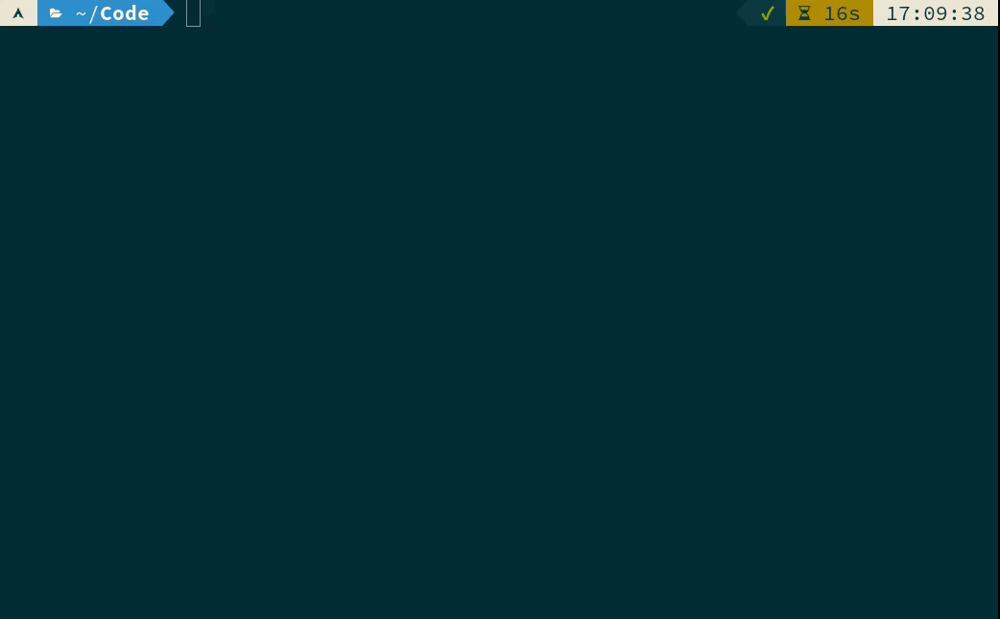

#  

Artificial Intelligence
Infrastructure-as-Code
Generator.

<kbd>[](demo.gif)</kbd>

<!-- vim-markdown-toc GFM -->

* [Description](#description)
* [Use Cases and Example Prompts](#use-cases-and-example-prompts)
    * [Generate IaC](#generate-iac)
    * [Generate Configuration Files](#generate-configuration-files)
    * [Generate CICD Pipelines](#generate-cicd-pipelines)
    * [Generate Policy as Code](#generate-policy-as-code)
    * [Generate Utilities](#generate-utilities)
    * [Command Line Builder](#command-line-builder)
    * [Query Builder](#query-builder)
* [Quick Start](#quick-start)
    * [Instructions](#instructions)
* [Example Output](#example-output)
* [Support Channels](#support-channels)
* [License](#license)

<!-- vim-markdown-toc -->

## Description

`aiac` is a command line tool to generate IaC (Infrastructure as Code) templates, configurations, utilities, queries and more
via [OpenAI](https://openai.com/)'s API. The CLI allows you to ask the model to generate templates
for different scenarios (e.g. "get terraform for AWS EC2"). It will make the
request, and store the resulting code to a file, or simply print it to standard
output.

## Use Cases and Example Prompts

### Generate IaC

- `aiac get terraform for a highly available eks`
- `aiac get pulumi golang for an s3 with sns notification`
- `aiac get cloudformation for a neptundb`

### Generate Configuration Files

- `aiac get dockerfile for a secured nginx`
- `aiac get k8s manifest for a mongodb deployment`

### Generate CICD Pipelines

- `aiac get jenkins pipeline for building nodejs`
- `aiac get github action that plans and applies terraform and sends a slack notification`

### Generate Policy as Code

- `aiac get opa policy that enforces readiness probe at k8s deployments`

### Generate Utilities

- `aiac get python code that scans all open ports in my network`
- `aiac get bash script that kills all active terminal sessions`

### Command Line Builder

- `aiac get kubectl that gets ExternalIPs of all nodes`
- `aiac get awscli that lists instances with public IP address and Name`

### Query Builder

- `aiac get mongo query that aggregates all documents by created date`
- `aiac get elastic query that applies a condition on a value greater than some value in aggregation`
- `aiac get sql query that counts the appearances of each row in one table in another table based on an id column`

## Quick Start

First, install `aiac`:

    brew install gofireflyio/aiac/aiac

Or using `docker`:

    docker pull ghcr.io/gofireflyio/aiac

Or using `go install`:

    go install github.com/gofireflyio/aiac/v2

Alternatively, clone the repository and build from source:

    git clone https://github.com/gofireflyio/aiac.git
    go build

### Instructions

1. Create your OpenAI API key [here](https://beta.openai.com/account/api-keys).
1. Click “Create new secret key” and copy it.
1. Provide the API key via the `OPENAI_API_KEY` environment variable or via the `--api-key` command line flag.

By default, aiac prints the extracted code to standard output and asks if it
should save or regenerate the code:

    aiac get terraform for AWS EC2

To store the resulting code to a file:

    aiac -o aws_ec2.tf get terraform for AWS EC2

To run using `docker`:

    docker run \
    -it \
    -e OPENAI_API_KEY=[PUT YOUR KEY HERE] \
    ghcr.io/gofireflyio/aiac get terraform for ec2

## Example Output

Command line prompt:

    aiac get dockerfile for nodejs with comments

Output:

```Dockerfile
FROM node:latest

# Create app directory
WORKDIR /usr/src/app

# Install app dependencies
# A wildcard is used to ensure both package.json AND package-lock.json are copied
# where available (npm@5+)
COPY package*.json ./

RUN npm install
# If you are building your code for production
# RUN npm ci --only=production

# Bundle app source
COPY . .

EXPOSE 8080
CMD [ "node", "index.js" ]
```

## Support Channels

We have two main channels for supporting AIaC:

1. [Slack community](https://join.slack.com/t/firefly-community/shared_invite/zt-1m0d5c740-EhHAAFV5mhYBNXxcMWJp7g): general user support and engagement.
2. [GitHub Issues](https://github.com/gofireflyio/aiac/issues): bug reports and enhancement requests.

## License

This code is published under the terms of the [Apache License 2.0](/LICENSE).
